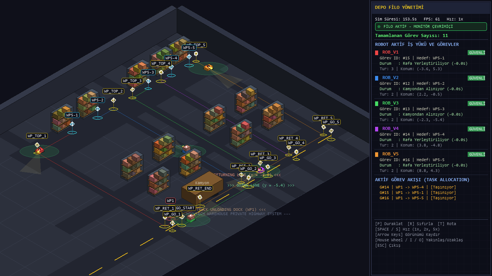
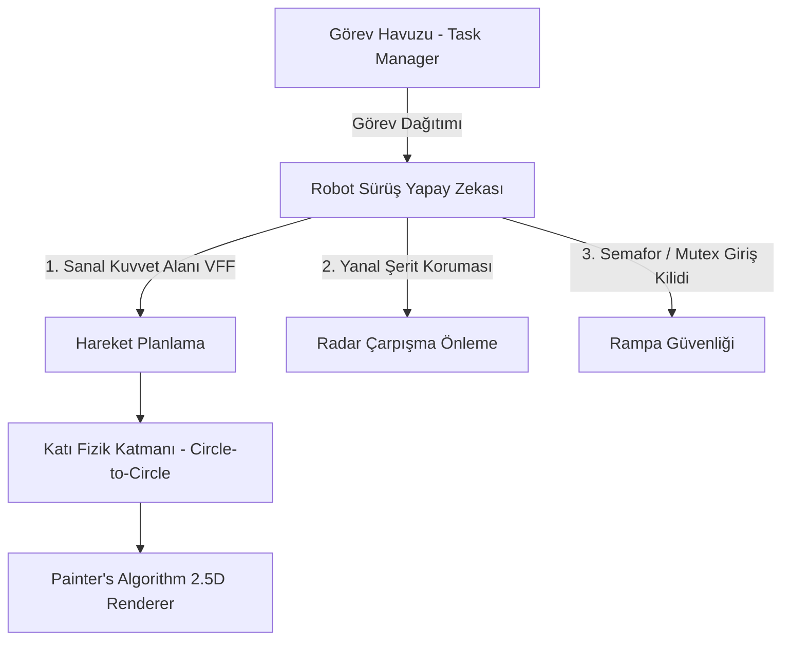

# Otonom Çoklu Robot Lojistik Simülasyonu (Multi-Robot Warehouse Sim 2.5D)



Bu proje, fütüristik bir akıllı depolama ortamında birden fazla otonom mobil robotun (AMR) görev paylaşımı yapmasını, çarpışmasız rotalamasını ve gerçek zamanlı katı fizik kurallarıyla hareket etmesini simüle eden 2.5D izometrik bir robotik çalışmasıdır. **Pygame** kütüphanesi kullanılarak sıfırdan geliştirilmiştir.

---

## 🎓 Proje Künyesi ve Akademik Bilgiler

| Parametre | Açıklama |
| :--- | :--- |
| **Üniversite** | Necmettin Erbakan Üniversitesi |
| **Ders** | Robotik |
| **Danışman Akademisyen** | Dr. Öğr. Üyesi Hasan Serdar |
| **Öğrenci Adı Soyadı** | Emre Aşcı |
| **Öğrenci Numarası** | 23370031075 |

---

## 🎯 Proje Tanımı ve Amacı

Bu çalışmanın temel amacı, endüstriyel depo lojistiğinde sıkça karşılaşılan **deadlock (kilitlenme)**, **rotasal çakışma** ve **dar geçit tıkanıklığı** problemlerini çözmek amacıyla otonom robot sürülerinin koordineli bir şekilde hareket edebileceği yüksek kararlılıkta bir simülasyon altyapısı kurmaktır.

### Temel Hedefler:
1. **Mekansal Rotalama İzolasyonu:** Her bir robota özel, birbiriyle çakışmayan dikey "Özel Otoban" (Private Highway) koridorları tahsis ederek rotasal kesişmeleri en aza indirmek.
2. **Yazılımsal Geçiş Kilidi (Mutex/Semaphore):** Kamyon yükleme rampası gibi tek yönlü dar geçiş noktalarında otonom geçiş sıralaması kurarak robotların birbirini kilitlemesini engellemek.
3. **Katı Fizik Entegrasyonu:** Robotlar arasında 2D katı çarpışma çözücü uygulayarak "hayalet geçişleri" ve fiziksel itişmeleri tamamen sıfırlamak.
4. **Fütüristik İzometrik Görselleştirme:** Depodaki robotik süreçleri, derinlik sıralamalı (Painter's Algorithm) estetik bir 2.5D arayüz ve kapsamlı bir kontrol paneli (HUD) ile gerçek zamanlı sunmak.

---

## 🎥 Sistem Çalışma Videosu

Depo lojistiği simülasyonunun gerçek zamanlı çalışma performansını, robotların şerit geçişlerini ve sıkışma önleme mekanizmalarını aşağıdaki videodan izleyebilirsiniz:

<video src="https://github.com/emrsc1/Coklu_Robot_Sistemleri/raw/main/assets/video.mp4" width="100%" controls autoplay loop muted></video>

*Eğer video tarayıcınızda veya mobil uygulamanızda otomatik olarak açılmıyorsa, doğrudan izlemek/indirmek için **[buraya tıklayabilirsiniz](https://github.com/emrsc1/Coklu_Robot_Sistemleri/raw/main/assets/video.mp4)**.*

---

## 🛠️ Kullanılan Teknolojiler

* **Programlama Dili:** Python 3.12+
* **Grafik ve Simülasyon Kütüphanesi:** Pygame 2.6.1 (2.5D İzometrik Projeksiyon ile)
* **Matematik Motoru:** Standart Python `math` modülü (Vektörel yönlendirmeler, Dot Product algılamaları ve Trigonometrik dönüşümler için)
* **Derleme/Yönetim:** Standart Python modülleri ve IDE entegrasyonu

---

## 🏗️ Sistem Mimarisi ve Algoritma Tasarımı

Proje, birbirine entegre edilmiş 5 ana teknik katmandan oluşmaktadır:



### 1. Özel Dikey Otoban (Private Highway) Mimarisi 🛣️
Robotlar yatayda ortak gidiş (`y = -5.40`) ve dönüş (`y = -4.80`) yollarını kullanırken, dikey olarak kendilerine özel tahsis edilmiş dikey şeritlerden seyahat ederler:
* **Robot 1:** $x = -3.75$ (Kamyon solundaki geniş boş alan)
* **Robot 2:** $x = 2.25$
* **Robot 3:** $x = 3.75$
* **Robot 4:** $x = 6.00$
* **Robot 5:** $x = 8.75$

Bu geometrik izolasyon sayesinde, robotların dikey şeritlerde seyahat ederken birbirleriyle kafa kafaya çakışması matematiksel olarak imkansız hale getirilmiştir.

### 2. Yanal Şerit Koruması (Lateral Lane Guard) 🛡️
Gereksiz hız kayıplarını önlemek için radar sistemine hareket yönü filtresi eklenmiştir:
* Robot dikey otoyolunda giderken, yanındaki şeritten geçen paralel robotları (`abs(dx) > 0.50`) radara dahil etmez.
* Aynı şekilde yatay yollardaki paralel robotlar (`abs(dy) > 0.50`) göz ardı edilir.
* Bu sayede yan yana geçen robotlar yavaşlamaz veya sağa sola yalpalama yapmaz.

### 3. Kamyon Alanı Yazılımsal Geçiş Kilidi (Software Mutex) 🔐
Kamyon yükleme noktasına (`WP1`) girişte oluşabilecek sıkışmaları önlemek için yazılımsal bir mutex tasarlanmıştır:
* Kamyona dönen bir robot, kuyruk bekleme noktasına (`WP_RET_END` - `[-1.00, -4.80]`) geldiğinde kamyonun başında başka bir robot olup olmadığını denetler.
* Eğer alan doluysa robot **hedef noktasında tam konumunda kilitlenerek bekler**.
* Bu sırada dikey geçiş koridoru (`x = -3.00`) tamamen boş kalır ve yükünü alan robot güneye doğru hiçbir engele takılmadan çıkış yapabilir. Çıkış tamamlandığında kilit açılır ve bekleyen robot sırayla içeri girer.

### 4. Daire-Daire Katı Fizik Çözücü (Rigidbody Circle Resolver) 💥
Robotların birbirlerinin içinden geçmesini ve kafa kafaya gelmelerde sonsuz itişmesini engellemek için her güncelleme karesinde çalışan katı cisim çarpışma çözücü eklenmiştir:
$$\text{Mesafe} < 2 \times R \quad (0.56\text{ birim})$$
Çakışma anında üst üste binen pay ($\text{overlap}$) hesaplanıp her iki robota da zıt yönlü olarak eşit ($50\% - 50\%$) itme kuvveti uygulanarak robotların fiziksel olarak iç içe geçmesi kesin olarak engellenir.

---

## 🎬 Simülasyon Senaryosu (Scenario Flow)

1. **Doğuş (Spawning):** Robotlar dönüş yolu çizgisine (`y = -4.80`) hizalı şekilde sırayla doğarlar ve gidiş-dönüş akışına tam uyumlu bir şekilde sıraya girerler.
2. **Görev Alımı:** Robotlar kamyon yükleme noktasına (`WP1`) yaklaşır, 3.0 saniye duraklayarak yükünü alır ve üzerlerinde taşıdıkları yükün rengini yansıtan bir görsel kutu belirir.
3. **Otobana Sevkiyat:** Kamyon çıkışından güneydeki gidiş başlangıç noktasına inen robot, kendi otoyol şeridine (`WP_GO_x`) sapar ve dikeyde hızla yukarı tırmanır.
4. **Boşaltma ve Teslimat:** Üst yola ulaşan robot, hedef rafına (`WP5-x`) gider, 3.0 saniye durarak yükünü boşaltır ve görevi tamamlar.
5. **Dönüş ve Kuyruk:** Boşalan robot üst otobandan geri dönüş şeridine geçer, kendi dönüş şeridinden (`WP_RET_x`) inerek `WP_RET_END` sırasına dahil olur ve kamyonun boşalmasını bekler.

---

## 💻 Simülasyon Ekranı ve Arayüz Özellikleri


Simülasyonda iki ana panel yer almaktadır:

### 1. Sol Panel: 2.5D İzometrik Depo Haritası
* **Modern Görsel Palet:** Canlı HSL tabanlı robot ve yük renkleri, koyu mavi endüstriyel epoksi zemin tasarımı ve izometrik derinlik çizgileri.
* **Etkin Derinlik Sıralaması (Painter's Algorithm):** 3D çizilen tüm nesneler (raflar, kamyon, robotlar, bayraklar) ekrandaki y-dünya koordinatlarına göre anlık sıralanarak mükemmel örtüşme ve gerçekçi yükseklik algısı sunar.
* **Kamera Kontrolleri:** Sol tıklama ile haritayı serbestçe sürükleme, fare tekerleği ile dinamik yakınlaşma/uzaklaşma (zoom).

### 2. Sağ Panel: Fütüristik Lojistik Monitörü (HUD Dashboard)
* Robotların anlık görev numaraları, hız oranları, tamamladıkları tur sayıları ve o anki durumları (Yol Veriyor, Yük Alıyor, Öncelikli Geçiş vb.).
* Sistem durumunu gösteren yeşil neon "MONİTÖR ÇEVRİMİÇİ" rozeti ve tamamlanan toplam görev sayacı.

---

## 📈 Proje Kazanımları (Educational Outcomes)

Bu projenin tamamlanmasıyla elde edilen önemli robotik ve yazılımsal kazanımlar:
* **Çoklu Ajan Koordinasyonu (Multi-Agent Coordination):** Karmaşık otonom sistemlerde merkezi bir rota planlayıcı olmadan, dağıtık kurallarla ve semaforlarla nasıl güvenli trafik yönetileceği öğrenilmiştir.
* **Sanal Kuvvet Alanları (VFF):** Hedefe çekim kuvveti ile engellerden kaçış itim kuvvetlerinin vektörel birleşimiyle pürüzsüz rota düzeltmeleri uygulanmıştır.
* **Katı Fizik Modelleme (Rigidbody Collision):** Oyun programlama ve robotik benzetimlerde daire ve kutu çarpışmalarının matematiksel çözümü deneyimlenmiştir.
* **Arayüz ve Kamera Matrisleri:** Dünya koordinatlarından 2D izometrik koordinat düzlemine dönüşüm ve matris bazlı kamera sürükleme mekaniği kavranmıştır.

---

## 🚀 Kurulum ve Çalıştırma

### Gereksinimler
Simülasyonu çalıştırmak için sisteminizde **Python** ve **Pygame** yüklü olmalıdır.

```bash
pip install pygame
```

### Çalıştırma
Projeyi klonladıktan veya indirdikten sonra terminal üzerinden ana dizine giderek aşağıdaki komutla simülasyonu başlatabilirsiniz:

```bash
python multi_robot_pygame.py
```

### Kısayol Tuşları
* `Fare Sol Tık (Basılı Tut)`: Haritayı sürükle / kaydır
* `Fare Tekerleği` veya `I` / `O`: Haritaya yakınlaş / uzaklaş
* `P`: Simülasyonu duraklat / devam ettir
* `SPACE` veya `S`: Simülasyon hızını değiştir (1x, 2x, 5x)
* `T`: Robotların rotasını gösteren kılavuz çizgileri aç / kapat
* `R`: Simülasyonu ilk durumuna sıfırla
* `ESC`: Simülasyondan güvenli çıkış yap
